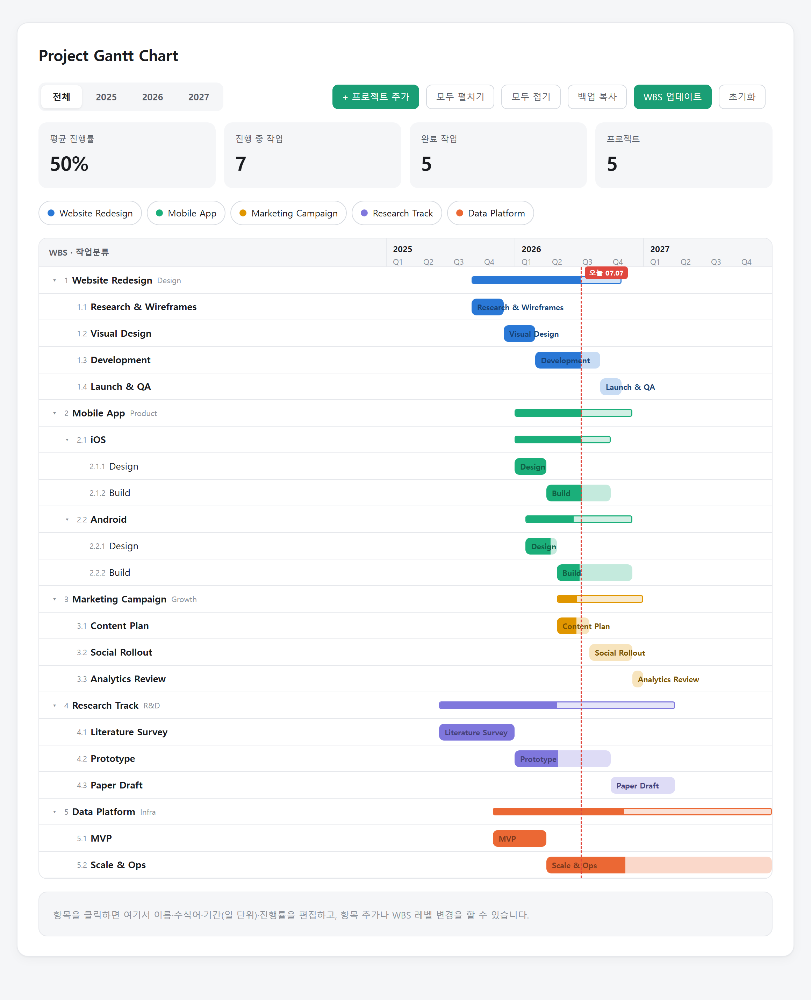

<div align="center">


# My Gantt

**HTML 파일 하나를 더블클릭하면 실행되는, 일(day) 단위 계층형 WBS 간트차트.**

A single-file, day-level, hierarchical WBS Gantt chart.

빌드 없음. 프레임워크 없음. 계정 없음. 데이터는 내 컴퓨터에만 남습니다.

[English](README.md) · **한국어**

### 👉 [**라이브 데모**](https://seobuk.github.io/my-gantt/) — 브라우저에서 바로 써보기



</div>

---

## 왜 만들었나

대부분의 간트 도구는 로그인, 구독, 그리고 당신의 데이터를 자기네 서버에 요구합니다.
My Gantt는 그 반대입니다: **HTML 파일 하나**, 순수 vanilla JS, 오프라인 동작,
그리고 JSON은 온전히 당신의 것입니다. 폴더 하나로 다년도 프로젝트 일정을 —
프로젝트 → 서브시스템 → 작업, 3단계(그 이상도) 깊이로 — 한 화면에서 관리하세요.

## 기능

- 📅 **일 단위 막대** — 다년도 타임라인 위에, 실시간 "오늘" 기준선 표시.
- 🌳 **3단계+ WBS 트리** — 펼치기/접기, 자동 번호(1 / 1.1 / 1.1.1).
- 🔄 **자동 롤업** — 상위 노드의 기간·진행률은 하위 항목에서 계산
  (기간 가중 평균 진행률).
- ✏️ **인라인 편집** — 이름 변경, 네이티브 날짜 선택기로 시작/종료일 지정,
  슬라이더로 진행률 조절, 완료/미착수 표시.
- 🧱 **구조 편집** — 형제/하위 추가, 들여쓰기/내어쓰기, 순서 변경,
  트리 통째로 다른 프로젝트로 이동, 삭제.
- 🎛️ **프로젝트별 필터 칩** + 요약 통계(평균 진행률, 진행 중/완료 작업).
- 🌗 **라이트 & 다크 모드**, 반응형, **외부 의존성 0개**.
- 💾 **이중 모드 저장** — Python 서버가 있으면 JSON 파일에, 없으면
  브라우저 `localStorage`에. 선택은 자유, UI는 동일.

> 기본 UI 라벨은 한국어지만, 모든 프로젝트/작업 이름은 자유 텍스트라
> 어떤 언어든 쓸 수 있습니다. (UI 다국어화 PR 환영합니다.)

## 빠른 시작

### 1. 그냥 열기 (설치 없음)
`web/projects_gantt.html`을 아무 브라우저로 엽니다. 편집 내용은 브라우저
`localStorage`에 저장됩니다. 가볍게 둘러보기 좋지만 그 브라우저에 종속됩니다.

### 2. 파일로 저장하며 쓰기 (권장)
프로젝트 루트에서 `run.py`를 더블클릭(또는 `python run.py`)하세요. Flask가 없으면
자동 설치하고, 로컬 서버를 띄운 뒤, 브라우저를 자동으로 엽니다.

```bash
python run.py
# → http://127.0.0.1:5173
```

이제 데이터는 `data/wbs.json`에 저장되므로 백업하거나 git으로 공유할 수 있습니다.

<details>
<summary>서버 수동 실행</summary>

```bash
cd python
pip install -r requirements.txt
python app.py   # → http://127.0.0.1:5173
```
</details>

**Windows:** `run.bat`을 더블클릭하세요 (`py -3.14` 사용; 필요하면 파일 안의 버전을 수정).

## 데이터

일정은 노드 객체의 평범한 JSON 배열입니다 — 사람이 읽기 쉽고 git 친화적입니다.

| 파일 | 역할 |
|------|------|
| `data/wbs_sample.json` | 시드 데이터. 첫 실행 시 앱이 이 파일을 읽습니다. 수정하거나 내 데이터로 교체하세요. |
| `data/wbs.json` | 실제 데이터 — 서버가 첫 저장 시 생성. 기본적으로 git에서 무시됩니다. |

노드는 **상위 노드**(`children` 보유)이거나 **말단 작업**(날짜 보유)입니다:

```jsonc
// 상위 노드 — 기간·진행률은 하위에서 자동 롤업
{ "name": "Mobile App", "co": "Product", "col": "#1baf7a", "children": [ ... ] }

// 말단 작업 — 실제 날짜를 가진 작업
{ "name": "Design", "s": "2026-01-01", "e": "2026-03-31", "pr": 100 }
```

| 필드 | 의미 |
|-------|---------|
| `name` | 작업/프로젝트 이름 (필수) |
| `children` | 있으면 상위 노드 (임의 깊이) |
| `s`, `e` | 시작/종료일, `YYYY-MM-DD`. `e`는 **그 날 포함** |
| `pr` | 진행률, 정수 `0`–`100` |
| `co` | 태그/담당 — **최상위** 노드에서만 표시 |
| `col` | 프로젝트 색(hex) — **최상위** 노드에서만 의미, 하위는 상속 |

타임라인 범위는 `Y0`–`Y1`(기본 `2025`–`2027`)입니다. 연도를 바꾸려면
`web/projects_gantt.html`의 `<script>` 상단에 있는 `Y0` / `Y1` 상수를 수정하세요.

## 프로젝트 구조

```
my-gantt/
├── web/projects_gantt.html   # 앱 전체 — UI + 로직, 빌드 불필요
├── python/
│   ├── app.py                # 작은 Flask 백엔드 (HTML 서빙 + 저장 API)
│   └── requirements.txt
├── data/
│   ├── wbs_sample.json       # 시드 데이터 (수정 가능)
│   └── wbs.json              # 실제 데이터 (git 무시, 자동 생성)
├── run.py / run.bat          # 한 번에 실행하는 런처
└── CLAUDE.md                 # 아키텍처 & 규칙
```

## 기여

이슈와 PR 모두 환영합니다 — **[🗺️ 로드맵 & good first issues](https://github.com/Seobuk/my-gantt/issues)**부터 보세요.
입문용으로 좋은 것: UI 다국어화(i18n), PNG 내보내기. 변경 전에 데이터 스키마와
설계 원칙은 [CLAUDE.md](./CLAUDE.md)를 참고하세요.

## 라이선스

[MIT](./LICENSE) — 마음껏 쓰세요.
